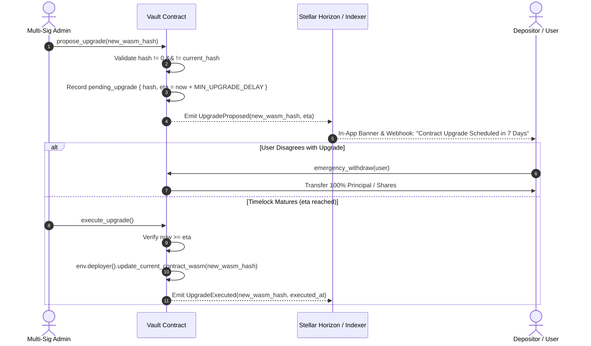

# Nester Contract Upgrade Posture & Governance Architecture

## 1. Executive Summary & Policy Decision

**Postural Decision: Upgradeable with Strict Non-Bypassable Timelock and Multi-Sig Governance.**

Nester's core smart contracts (`VaultContract`, `VaultFactoryContract`, `TreasuryContract`, `AllocationStrategyContract`, and `YieldRegistryContract`) are deployed on Stellar Soroban as **upgradeable contracts** governed by non-bypassable on-chain timelocks and multi-sig authorization, paired with an immutable emergency exit escape hatch.

### Rationale: Upgradeable vs. Immutable
- **Economic Safety & Bug Fixability**: Complete immutability creates existential risk in algorithmic yield vaults when external integrated protocols (Blend, Soroswap, Stellar DEX) change their interfaces, suffer upstream exploits, or require parameter changes.
- **Rug-Pull Mitigation**: Unrestricted or instant upgradability introduces trust assumptions unacceptable for non-custodial financial software.
- **The Nester Compromise**: All contract WASM upgrades and parameter mutations require a **mandatory timelock delay** (minimum 7 days on Mainnet, 48 hours on Testnet), emit real-time transparent events (`UpgradeProposed`), and preserve the unconditional permissionless emergency exit hatch (`emergency_withdraw` and `emergency_withdraw_all`) so depositors can withdraw 100% of their capital before any code upgrade takes effect.

---

## 2. Upgrade Governance & Authorization Matrix

| Contract | Upgrader Role | Minimum Delay (Mainnet) | Minimum Delay (Testnet) | Emergency Exit During Timelock |
| :--- | :--- | :--- | :--- | :--- |
| **`VaultContract`** | Multi-Sig Admin (via Timelock) | 7 Days (604,800 s) | 48 Hours (172,800 s) | ✅ Always Active |
| **`VaultFactoryContract`** | Multi-Sig Admin (via Timelock) | 7 Days (604,800 s) | 48 Hours (172,800 s) | N/A |
| **`TreasuryContract`** | Multi-Sig Admin (via Timelock) | 7 Days (604,800 s) | 48 Hours (172,800 s) | ✅ Always Active |
| **`YieldRegistryContract`** | Multi-Sig Admin (via Timelock) | 7 Days (604,800 s) | 48 Hours (172,800 s) | N/A |
| **`AllocationStrategyContract`** | Multi-Sig Admin (via Timelock) | 7 Days (604,800 s) | 48 Hours (172,800 s) | ✅ Always Active |

### Authorization Constraints:
1. **Multi-Sig Admin Only**: Only the authorized multi-signature governance contract or admin threshold can call `propose_upgrade(wasm_hash)`.
2. **No Single-Key Privileges**: No individual key or operator role has direct upgrade permissions.
3. **Role Separation**:
   - `Admin`: Proposes and executes upgrades after timelock expiration; manages fee configurations and role delegations.
   - `Guardian`: Can trigger immediate emergency halts (`pause`, `FullHalt`), but **CANNOT** propose, bypass, execute, or cancel code upgrades.
   - `Manager / Operator`: Manages daily yield harvesting and rebalance actions within hardcoded slippage and caps; has zero upgrade capabilities.

---

## 3. The 4-Stage Upgrade Lifecycle

### Stage Details:
1. **Proposal (`propose_upgrade`)**:
   - Admin submits the cryptographic SHA-256 hash of the audited new WASM binary.
   - Contract records `pending_wasm_hash` and `upgrade_eta = ledger.timestamp + MIN_UPGRADE_DELAY`.
   - Contract emits `UpgradeProposedEventData { wasm_hash, upgrade_eta, proposer }`.
2. **Public Notice & Timelock Horizon**:
   - The on-chain indexer captures the event and broadcasts real-time alerts across the DApp frontend banner, Telegram/Discord bot channels, and Webhook endpoints.
   - Users have the entire timelock duration (minimum 7 days) to review the public open-source diff and audit reports.
3. **Opt-Out & Capital Protection**:
   - If any user disagrees with the pending upgrade, they can execute `emergency_withdraw` or `withdraw` immediately with zero lockup or penalty interference.
4. **Execution or Cancellation**:
   - After `upgrade_eta` has elapsed, `execute_upgrade()` can be triggered to atomically replace the executable bytecode using Soroban's `update_current_contract_wasm`.
   - Admin can call `cancel_upgrade()` at any point before execution if an issue is discovered.

---

## 4. State & Asset Preservation Guarantees

1. **Storage Layout Preservation**:
   - Upgraded contracts MUST adhere to strict Soroban `DataKey` backwards-compatibility conventions.
   - No upgrade can overwrite, re-index, or invalidate existing storage keys (`UserShares`, `TotalAssets`, `UserPrincipal`, `FeeConfig`, etc.).
2. **Balance Conservation**:
   - Contract balances and token shares remain continuous across upgrades.
   - Total supply invariant $\sum \text{user\_shares} = \text{total\_shares}$ and asset backing $A_{\text{total}} \ge \sum A_{\text{user}}$ hold unbroken before and after execution.
3. **Rollback Posture**:
   - If a newly executed WASM exhibits unexpected behavioral anomalies, the protocol can immediately be halted by Guardians (`pause`), followed by proposing the previous known-good WASM hash through the timelock process.

---

## 5. Verification & Test Assertions

The upgrade posture and governance constraints are tested and enforced by permanent unit and integration tests:
- `test_upgrade_lifecycle_full_flow`: Proves the full proposal → delay expiration → execution lifecycle.
- `test_treasury_upgrade_delay_requirement`: Enforces that attempting to execute before `upgrade_eta` reverts with `TimelockNotExpired`.
- `test_upgrade_cancellation_and_access_control`: Asserts unauthorized accounts cannot propose or execute upgrades, and cancellations clear state.
- `test_emergency_withdrawal_during_pending_upgrade`: Proves users can withdraw 100% of their capital throughout the active timelock window.
